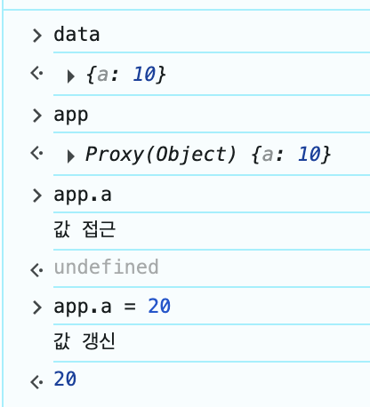

## 노트

### 1. Vue 3 Reactivity - Proxy 소개
* `vue3` > `vue3` > `reactivity.html`

```html
<div id="app"></div>

<script>
    const data = {
        a: 10
    }

    const app = new Proxy(data, {
        get() {
            console.log('값 접근')
        },
        set() {
            console.log('값 갱신')
        }
    })
</script>
```
*  `data`라는 객체에 접근했을 때의 동작을 `get(){}` 안의 `console.log`로 정의했다
* 즉, `{}` 안에 `data`에 접근했을 때의 동작을 정의할 수 있는 것이다.


### 2. Vue 3 Reactivity - 동작 원리 구현

```html
<div id="app">

</div>

<script>
    const data = {
        message: 10
    }

    function render(sth) {
        const div = document.querySelector('#app');
        div.innerHTML = sth;
    }

    const app = new Proxy(data, {
        get() {
            console.log('값 접근')
        },
        set(target, prop, newValue) {
            console.log('값 갱신')
            target[prop] = newValue;
            render(newValue);
        }
    })
</script>
```
* `render`를 정의하고, `newValue`를 통해서 값이 실시간으로 바뀐다.

### 3. Reactivity 차이점 - Vue 2 & Vue 3
* 기존에는 미리 정의되어 있지 않은 속성에 대해서는 리액티비티가 주입되지 않는 한계

### 4. Vue Instance
* `new Vue()`
    * 새로운 인스턴스 객체
* `Vue.js` 개발을 할 때는 기본적으로 `Vue.createApp` 이라고 하는 것을 무조건 실행해줘야 한다.

```html
<script src="https://unpkg.com/vue@3/dist/vue.global.js"></script>

<body>
    <div id="app">
        {{ message }}
    </div>
</body>

<script>
    // Vue 2 문법
    new Vue({
        el: '#app'
    })

    new Vue({

    }).mount('#app')

    // Vue 3 문법
    Vue.createApp({
        data() {
            return {
                message: 'hi'
            }
        }
    }).mount('#app');
</script>
```

### 5. Vue Methods

```javascript
new Vue({
    el: ,
    template: ,
    data: ,
    methods: ,
    created: ,
    watch: ,
})
```
* 인스턴스 안에 있는 속성들을 컴포넌트 옵션 속성 혹은 인스턴스 옵션 속성 혹은 옵션 API라고도 불린다.
* 인스턴스 안에 옵션 속성들을 추가할 수 있음.

* `vue3` > `methods.html`

```html
<!-- html -->
<div id="app">
    <p>{{count}}</p>
    <!-- v-on -> 디렉티브 -->
    <button v-on:click="addCount">+</button>
</div>

<!-- javascript -->
<script src="https://unpkg.com/vue@3/dist/vue.global.js"></script>
<script>
    Vue.createApp({
        data() {
            return {
                count: 0
            }
        },
        methods: {
            addCount() {
                this.count++
            }
        }
    }).mount('#app');
</script>
```
* `button` 태그에 `v-on:click` 으로 `onClick`과 유사한 기능을 수행
    * `v-`가 붙은 `HTML Attribute`가 `Vue`의 디렉티브이다.
* `methods`로 `addCount`를 정의하여 버튼을 누를 때마다 숫자가 1씩 더해지는 기능을 만든다.

### 6. Vue Directive: v-for
* `v-on` 버튼의 클릭 이벤트를 제어
    * `click` 뿐만아니라 `mouseover` 등의 `UI 이벤트`를 다 연결할 수 있게 된다.
* `v-if`, `v-else`, `v-for`, `v-bind` 등의 여러가지 디렉티브들이 존재한다.

```html
<body>
    <div id="app">
        <ul>
            <li v-for="item in items">
                {{ item }}
            </li>
        </ul>
    </div>
</body>

<script src="https://unpkg.com/vue@3/dist/vue.global.js"></script>
<script>
    Vue.createApp({
        data() {
            return {
                items: ['삼성', '네이버', '인프런']
            }
        },
    }).mount('#app')
</script>
```
